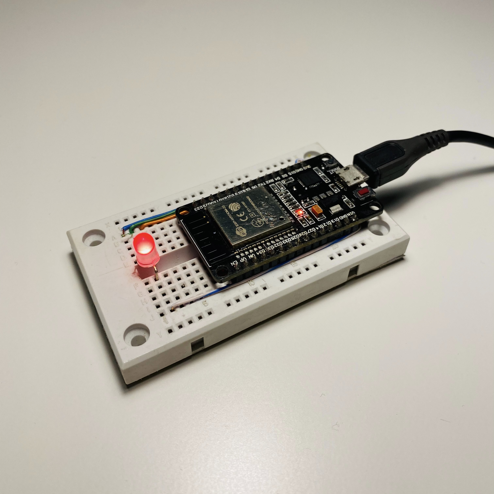
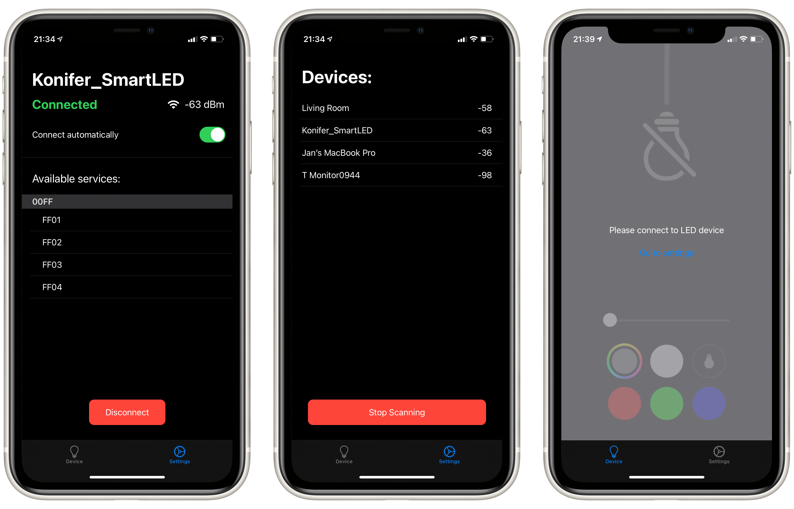

# SwiftUI_SmartLED_App

>App for control RGB LED ambient light. 
iPhone is connected via BLE with ESP32 SoC which controls RGB LED(or with few code changes any Bluetooth device)
  
## This app is used for controll via Bluetooth ESP32_SmartLED_Device. More info about hardware: 
[ESP32_SmartLED_Device]

 
 
## Quick LED controls

 
 
## Detailed LED color controls

## Settings and connected device info

## App funcionality
  - Discover nerby Bluetooth pheriperals
  - Connect to any Bluetooth pheriperals, discover their services and characteristics. (I can limt app, to search only my device but for educational reasons I decided to allow my app to discover, connect and dive into every Bluetooth devices nerby)
  - Remember LED device in persistent storage for future autoconnection
  - Converting SwiftUI color into binary data and sending it via BLE to my device.
  - Turn ON/OFF LED by quick tap on hanging bulb
  - Control LED Brightness
  - Control LED Color via quick color buttons or using new in iOS14 SwiftUI Color Picker
  - Cool bulb animation thats lights up whole user interface 
  - Accelerometer support for moving hanging bulb depending on the tilt of the phone.
  - App supports Light and Dark Mode.
   

## Tech
* [Apple SwiftUI] - interface created with SwiftUI.
* [Apple Core Bluetooth] - enabling iPhone Bluetooth connections.
* [Apple Core Motion] - detecting iPhone tilt

## Hadrware 
* [ESP32] - used SoC
* [ESP-IDF] - used to program ESP32 SoC
* [ESP32_SmartLED_Device] - my device

[Apple Core Bluetooth]: <https://developer.apple.com/documentation/corebluetooth>
[Apple Core Motion]: <https://developer.apple.com/documentation/coremotion>
[Apple SwiftUI]: <https://developer.apple.com/documentation/swiftui/>
[ESP-IDF]: <https://docs.espressif.com/projects/esp-idf/en/latest/esp32/>
[ESP32]: <https://www.espressif.com/en/products/socs/esp32>
[ESP32_SmartLED_Device]: <https://github.com/konifer44/ESP32_SmartLED_Device>
